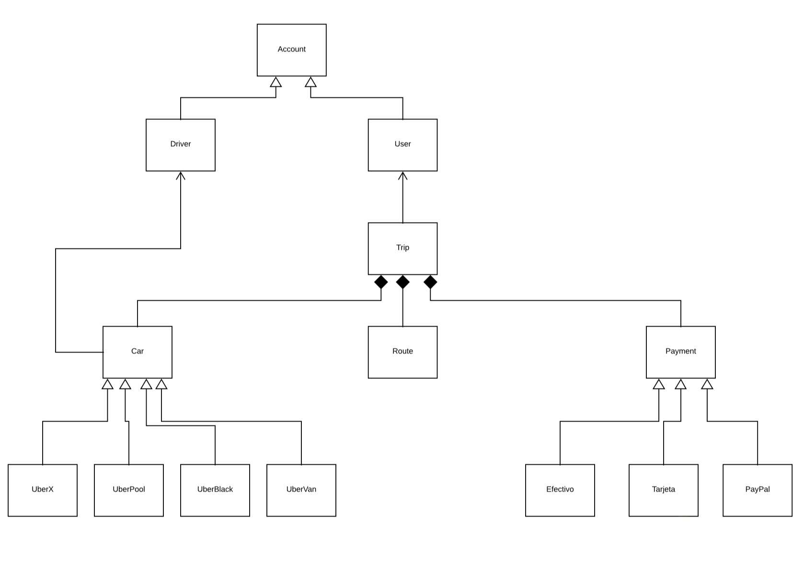

# OOP Uber project in python
This project use the object oriented programing paradigm for modeling an Uber backend system in python.

# Diagram



According to the OOP, there were created 13 classes:

```py
class Account:
class Car:
class Driver:
class Efectivo:
class Payment:
class Paypal:
class Route:
class Tarjeta:
class UberBlack:
class UberPool:
class UberVan:
class UberX:
class User:
```

# Main code and classes:

The system is connected by the main.py code below:

```py
from car import Car
from account import Account
from UberX import UberX  #desde el archivo UberX importamos la clase UberX. Lo mismo con las otras importaciones.
from user import User

if __name__ == "__main__":
    print("Inicializando la información de los carros")
    print("Car")
    car = Car("AMS234", Account("Abrahan  Torres", "ANDA876", "abrahamtorres2021@gmail.com", "2563"))  #Llamamos la clase car, fijarse la construcción, llama a la licencia
                                                                                                       # y al driver, sin embargo el driver lleva a Account en la clase car.           
    
    print(vars(car))  #Usamos vars para llamar al objeto
    print(vars(car.driver))


    print("UberX")
    uberX = UberX("KLO365", Account("Marco Lois", "SGHJ12336", "marzo@platzi.com", "7856"), "Toyota", "Corolla")  #Se saca de la classe UberX que tiene license, driver, brand y model.
    print(vars(uberX))
    print(vars(uberX.driver))


    print("User")
    user = User("Mariana Valle", "SDFG125F", "marina@platzi.com", 7856)
    print(vars(user))

```

## Class Account:

```py
class Account:
    id       = int
    name     = str
    document = str
    email    = str
    password = str

    def __init__(self, name, document, email, password):
        self.name = name
        self.document = document
        self.email = email
        self.password = password
```

## Class Car:
```py
from account import Account
class Car:
    id = int
    license = str
    driver = Account(str,str,str,str,) #De la clase Account sacamos sus atributos, son 4, name, document, email, password.
    passengers = int

    def __init__(self, license, driver):  #De la clase Car solo llamamos a license y driver.
        self.license = license
        self.driver = driver 
```

## Class Driver:
```py
from account import Account

class Driver(Account):
    def __init__(self, name, document, email, password):
        super().__init__(name, document, email, password) #el super().__init__ llama a los atributos de la clase padre.
```

## Class Efectivo:
```py
from payment import Payment

class Efectivo(Payment):


    def __init__(self, id):
        super().__init__(id)
```

## Class Payment:
```py
class Payment:
    id = int

    def __init__(self, id):
        self.id = id
```

## Class Paypal:
```py
from payment import Payment

class Paypal(Payment):
    referencia = str
    modo = str

    def __init__(self, id, referencia, modo):
        super().__init__(id)
        self.referencia = referencia
        self.modo = modo
```

## Class Route:
```py
class Route:
    id      = int
    start   = []
    end     = []
```

## Class Tarjeta:
```py
from payment import Payment
from datetime import date

class Tarjeta(Payment):
    franquicia = str
    fechaVencimiento = date.today()
    cvv = str

    def __init__(self, id, franquicia, fechaVencimiento, cvv):
        super().__init__(id)
        self.franquicia = franquicia
        self.fechaVencimiento = fechaVencimiento
        self.cvv = cvv
```

## Class UberBlack:
```py
from car import Car

class UberBlack(Car):
    typeCarAccepted = []
    seatsMaterial = []

    def __init__(self, license, driver, typeCarAccepted, seatsMaterial):
        super().__init__(license, driver)
        self.typeCarAccepted = typeCarAccepted
        self.seatsMaterial = seatsMaterial
```

## Class UberPool:
```py
from car import Car

class UberPool(Car):
    brand = str
    model = str

    def __init__(self, license, driver, brand, model):
        super().__init__(license, driver)
        self.brand = brand
        self.model = model
```

## Class UberVan:
```py
from car import Car

class UberVan(Car):
    typeCarAccepted = []
    seatsMaterial = []

    def __init__(self, license, driver, typeCarAccepted, seatsMaterial):
        super().__init__(license, driver)
        self.typeCarAccepted = typeCarAccepted
        self.seatsMaterial = seatsMaterial
```

## Class UberX:
```py
from car import Car

class UberX(Car):
    brand = str
    model = str

    def __init__(self, license, driver, brand, model):
        super().__init__(license, driver)
        self.brand = brand
        self.model = model
```

## Class User:
```py
from account import Account

class User(Account):
    def __init__(self, name, document, email, password):
        super().__init__(name, document, email, password) #el super().__init__ llama a los atributos de la clase padre.
```
## END


